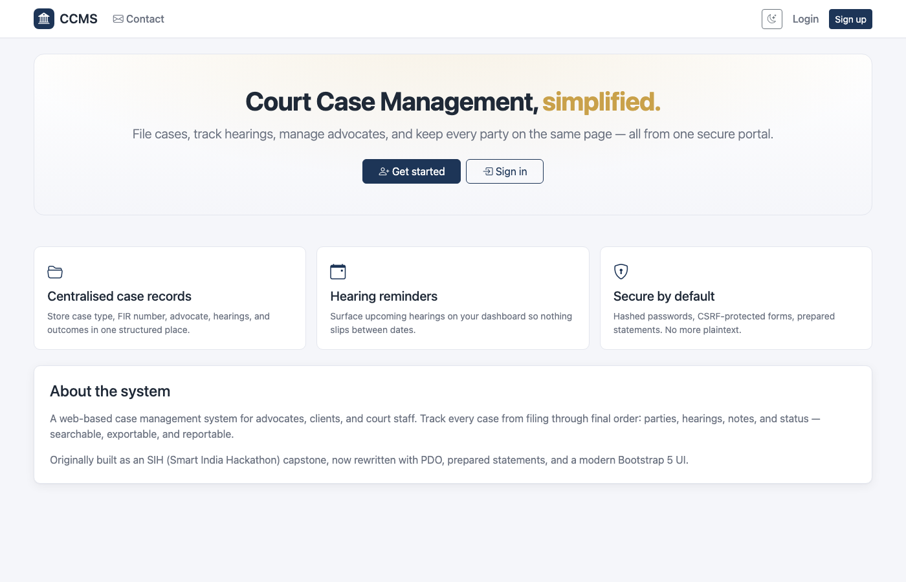
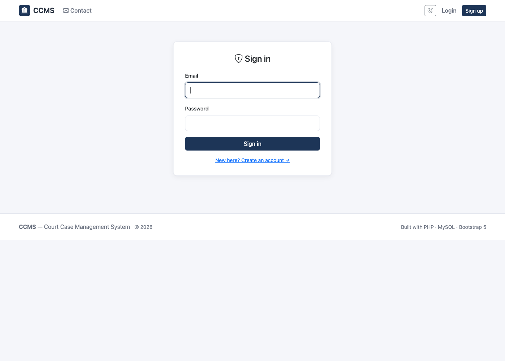
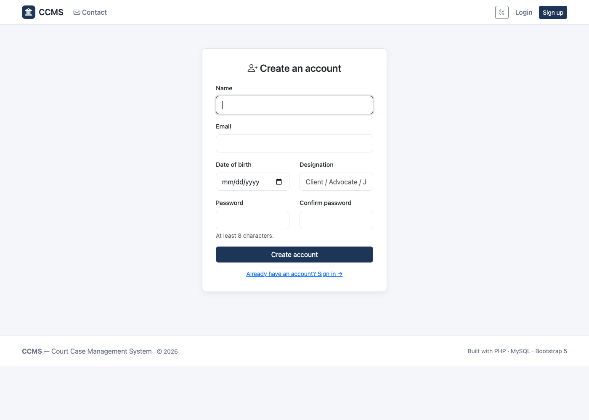

# Court Case Management System (CCMS)


A full-stack web application for managing court cases end-to-end: filing, hearings, advocates,
notes, and outcomes. Originally built as a Smart India Hackathon (SIH) capstone, now rewritten
with a modern stack: **PDO + prepared statements, password hashing, CSRF protection, Bootstrap 5,
dark mode, and a proper relational schema.**

## Highlights

- **Authentication** — Sign up / sign in with `password_hash` + `password_verify` (no MD5).
- **CSRF protection** — All forms include a token validated on POST.
- **PDO prepared statements** — SQL injection surface eliminated.
- **Dashboard** — Live counts (Total / Open / In progress / Closed) and upcoming hearings widget.
- **Cases CRUD** — File, view, edit, delete, with breadcrumbs and validation.
- **Search & filter** — Full-text style search + status filter + multi-column sort + pagination.
- **Status workflow** — `open → in_progress → adjourned → closed | dismissed | won | lost`.
- **Priority** — Low / Medium / High / Urgent, surfaced visually in lists.
- **Notes & timeline** — Threaded notes per case with timestamps and authors.
- **Hearing reminders** — Dashboard surfaces hearings in the next 14 days with day-relative labels.
- **Contact form** — Persisted to `contact_messages` for back-office triage.
- **Dark mode** — Full theme toggle with `localStorage` persistence.
- **Modern UI** — Bootstrap 5 + Bootstrap Icons, custom design tokens, responsive.
- **JSON API** — `/api/stats.php` for the current user's case counts.
- **Environment config** — `.env` driven, no hardcoded credentials.

## Screenshots

| Landing | Sign in | Sign up |
|---|---|---|
|  |  |  |

_(More screenshots — dashboard, case list, case detail, dark mode — to be added once a live demo deployment is available.)_

## Tech Stack

| Layer    | Tech                                               |
|----------|----------------------------------------------------|
| Backend  | PHP 7.4+ (PDO, MySQLi-free)                        |
| Database | MySQL 5.7+ / MariaDB 10.3+, InnoDB, FULLTEXT index |
| Frontend | Bootstrap 5.3, Bootstrap Icons, vanilla JS         |
| Sessions | PHP native, hardened cookies (HttpOnly, SameSite)  |

## Project Structure

```
.
├── PHP/
│   ├── config/
│   │   ├── env.php              # .env loader
│   │   ├── db.php               # PDO singleton
│   │   └── auth.php             # session, CSRF, helpers
│   ├── includes/
│   │   ├── header.php           # shared <head> + navbar
│   │   ├── footer.php           # shared <footer> + JS
│   │   ├── errors.php           # validation error renderer
│   │   └── case_form_fields.php # shared add/edit form
│   ├── assets/
│   │   ├── css/styles.css       # design tokens + components
│   │   └── js/app.js            # theme toggle, confirm
│   ├── api/
│   │   └── stats.php            # JSON case stats
│   ├── index.php                # landing
│   ├── login.php  signup.php  logout.php  forgotpass.php
│   ├── dashboard.php            # stats + upcoming + recent
│   ├── cases.php                # list, search, filter, paginate
│   ├── case_view.php            # detail + notes + status
│   ├── case_edit.php  case_delete.php
│   ├── addcase.php              # file new case
│   ├── contact.php              # contact form (stored)
│   └── thankyou.php  server.php # legacy compatibility shims
├── Image/                       # screenshots, logo, presentation
├── schema.sql                   # full DB schema
├── .env.example                 # config template
└── SETUP.md                     # local install guide
```

## Quick Start

```bash
git clone https://github.com/Sanjays2402/Court-Case-Management.git
cd Court-Case-Management
cp .env.example .env             # then edit DB creds
mysql -u root -p < schema.sql
php -S localhost:8080 -t PHP     # dev server
```

Visit <http://localhost:8080>. See [SETUP.md](SETUP.md) for production deployment notes
(Apache / Nginx, .htaccess, HTTPS hardening).

## Database Schema

Five tables:

- `users` — accounts, roles (`client`, `advocate`, `admin`), hashed passwords.
- `cases` — case records with FK to `users`, FULLTEXT index for search.
- `hearings` — chronological hearing records (FK to `cases`).
- `case_notes` — free-form notes (FK to `cases` and `users`).
- `contact_messages` — contact-form submissions.

Status enum: `open`, `in_progress`, `adjourned`, `closed`, `dismissed`, `won`, `lost`.
Priority enum: `low`, `medium`, `high`, `urgent`.

See [`schema.sql`](schema.sql) for the full DDL.

## Security

- Passwords hashed with `password_hash` (bcrypt by default).
- All SQL via PDO prepared statements — no string interpolation.
- CSRF tokens generated per session and validated on every POST.
- Session cookies set with `HttpOnly` + `SameSite=Lax` (and `Secure` on HTTPS).
- All output escaped via `ccms_e()` (`htmlspecialchars`).
- Authorization checks on every case-scoped action (`WHERE user_id = ?`).

## Roadmap

- [ ] Email-based password reset (token + expiry table).
- [ ] Document upload per case (S3 / local with size limits).
- [ ] Admin panel for managing users + reading contact messages.
- [ ] Calendar view for hearings.
- [ ] CSV export of cases and hearings.
- [ ] Email reminders for hearings within 24/48 hours.
- [ ] Two-factor authentication.

## Author

**Sanjay Santhanam** — [@Sanjays2402](https://github.com/Sanjays2402)

## License

MIT — see [LICENSE](LICENSE) (add one if missing).

---

⭐ Star this repo if you found it useful!
